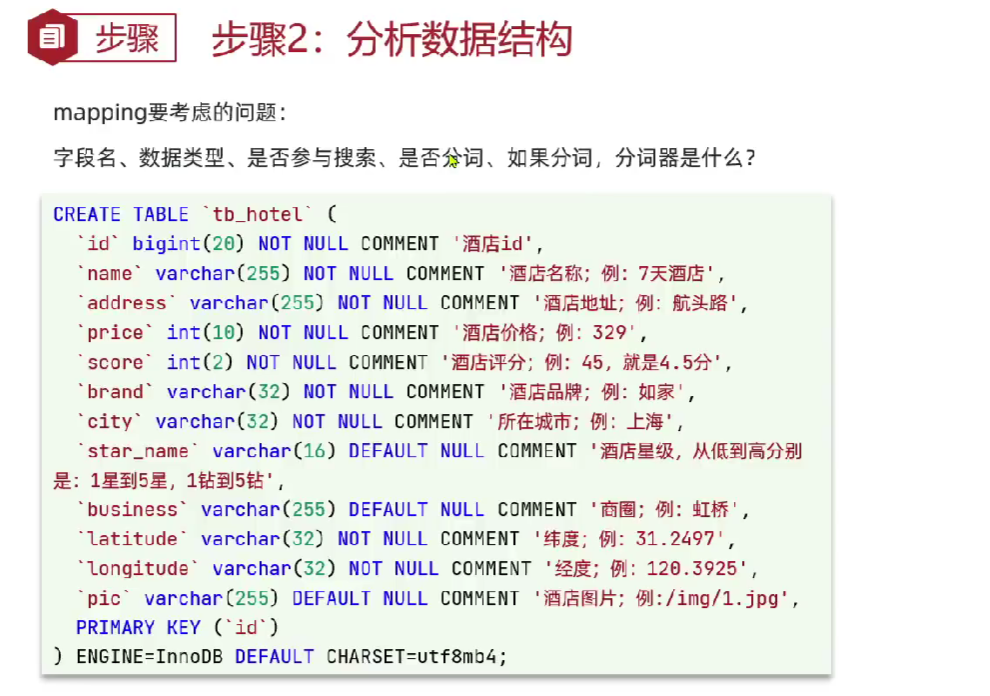
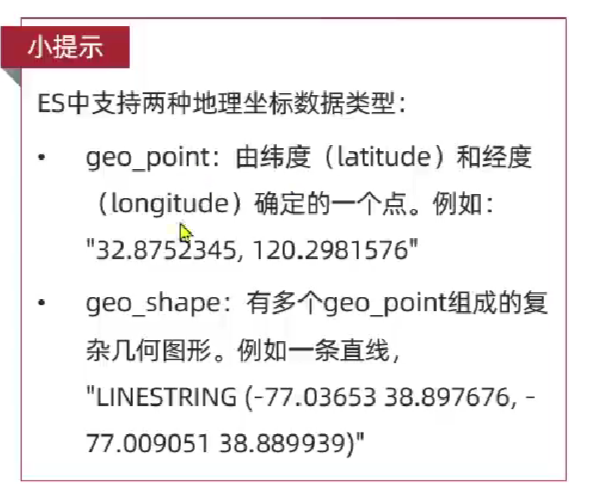

## hotel数据结构分析

主要分析pojo字段的类型，以及字段的名称，**是否分词，如果是分词，定分词器用什么**



- text 分词
- keyword 不分词
- index 索引, 默认true,创建索引，**所有参与排序过滤搜索的字段，都需要创建索引**


### 地理坐标
elasticsearch 支持地理坐标的存储，使用geo_point、geo_shape类型  
geo_point 存储经纬度, geo_shape 存储多边形


### copy to
真实业务存在需要多个字段同时搜索，即根据酒店名称，位置，价格等同时搜  
所以新增一个all，将这个几个字段的数据整和到all中


```kibana

# 酒店的mappping
PUT /hotel
{
  "mappings" : {
    "properties" : {
      "id" : {
        "type" : "keyword"
      },
      "name" : {
        "type" : "text",
        "analyzer" : "ik_max_word",
        "copy_to" : "all"
      },
      "address" : {
        "type" : "keyword",
        "index" : false
      },
      "priee" : {
        "type" : "integer"
      },
      "score" : {
        "type" : "integer"
      },
      "brand" : {
        "type" : "keyword",
        "copy_to" : "all"
        
      },
      "city": {
        "type" : "keyword"
      },
      "starName" : {
        "type" : "keyword"
      },
      "business" : {
        "type" : "keyword",
        "copy_to" : "all"
      },
      "location" : {
        "type" : "geo_point"
      },
      "pic" : {
        "type" : "keyword",
        "index" : false
      },
      "all" : {
        "type" : "text",
        "analyzer" : "ik_max_word"
      }
    }
  }
}
```