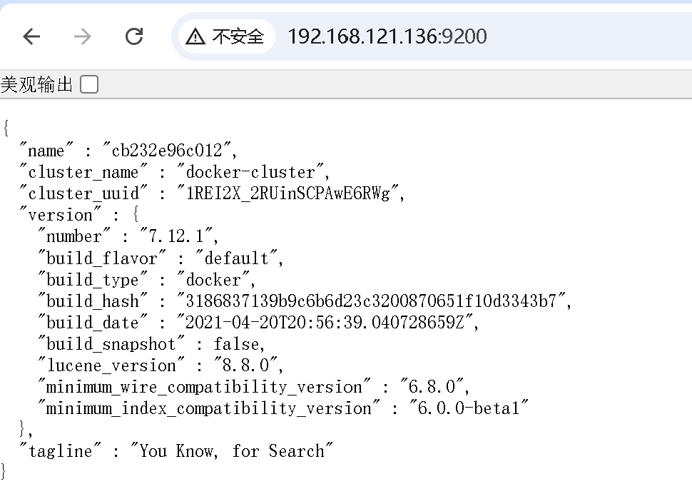

## 安装es

### 创建网络
docker network create es-net

### docker run 启动es容器
es镜像过大，可以用国内镜像地址下载：https://1ms.run/
```shell
docker run -d \
  --name es \
  -e "ES_JAVA_OPTS=-Xms512m -Xmx512m" \
  -e "discovery.type=single-node" \
  -v es-data:/usr/share/elasticsearch/data \
  -v es-plugins:/usr/share/elasticsearch/plugins \
  --privileged \
  --network es-net \
  -p 9200:9200 \
  -p 9300:9300 \
  elasticsearch:7.12.1
```
### 访问9200

