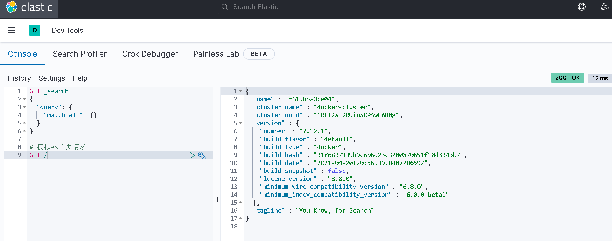

## 安装kibana
docker pull docker.1ms.run/kibana:7.12.1
```shell
docker run -d \
 --name kibana \
 -e ELASTICSEARCH_HOSTS=http://es:9200 \
 --network=es-net \
 -p 5601:5601 \
 docker.1ms.run/kibana:7.12.1
```
安装成功后访问5601端口

### 使用devtools
使用devtools编写DSL语句请求es

