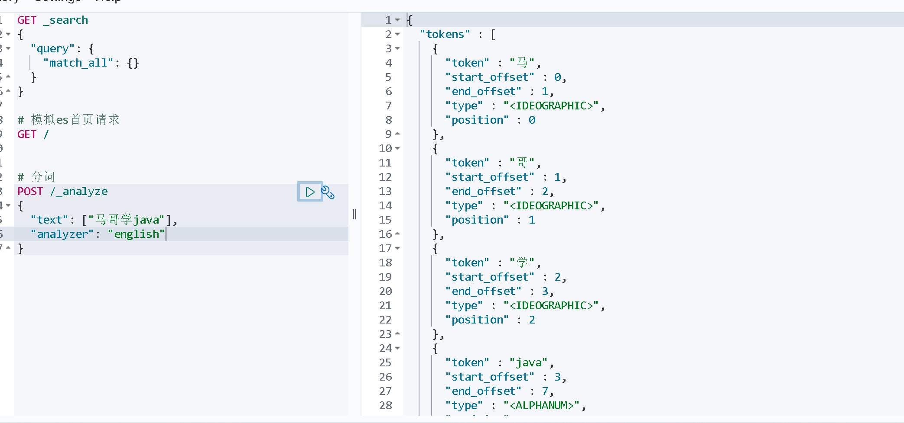
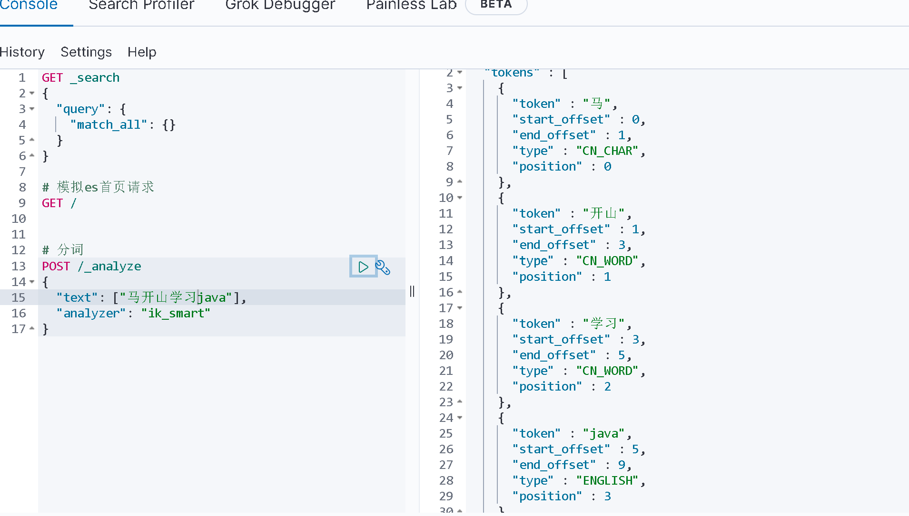

## 安装IK分词器

### 使用POST /_analyze
使用请求对文档分词  
POST /_analyze
```json
{
"text": ["马哥学java"],
"analyzer": "chinese"
}
```
结果并不能很好的对中文分词，无法按内容分词



### 直接拉取带有IK分词器的镜像

### 手动安装IK分词器
- 在es容器中的plugin目录下_data文件夹，放入下载好的ik分词器  
- 重启es容器
- 使用docker commit将容器提交为镜像

已经可以根据中文语义分词


ik版本地址：https://release.infinilabs.com/analysis-ik/stable/