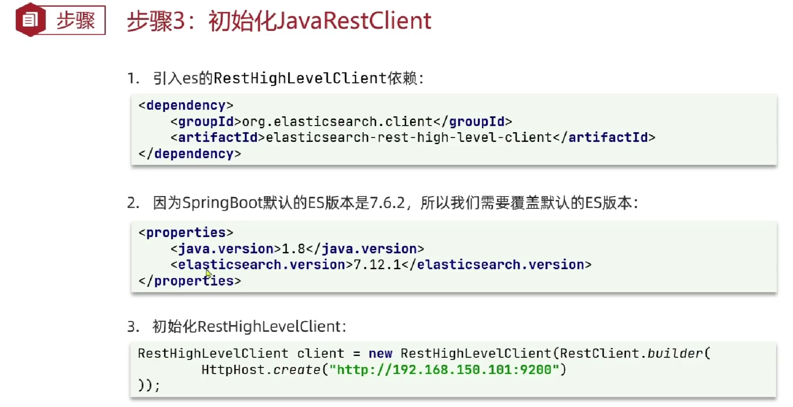
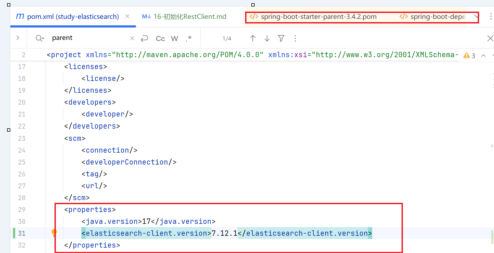

## 初始化RestClient


导入依赖
```xml
<dependency>
    <groupId>org.elasticsearch.client</groupId>
    <artifactId>elasticsearch-rest-high-level-client</artifactId>
    <version>7.12.1</version>
</dependency>
```
- 查看maven dependency发现引入的elasticsearch版本为8.0,  
但是我们使用的是7.12.1版本的es,   
springBoot的父工程帮我们管理了整个版本，我们需要在子工程中重写版本

