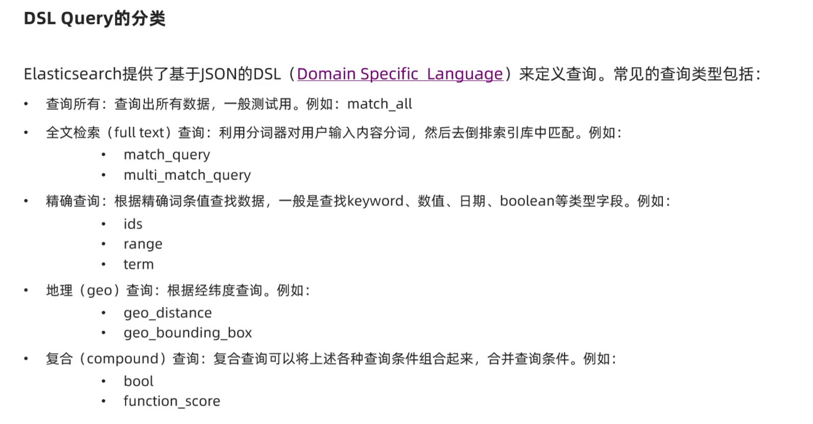

## DSL查询分类和基本语法
- 查询所有
- 精确查询
- 地理信息查询
- 复合查询



### 全文检索查询
match查询，对用户输入的词进行分词，然后进行检索，返回匹配度最高的文档。

```kibana
# 全文检索查询
GET /hotel/_search
{
  "query": {
    "match": {
      "all": "外滩酒店"
    }
  }
}
```
muti match查询，允许同时对多个字段进行检索
muti match 是在多个文档字段中进行搜索，而不是在单个文档字段中搜索，  
效率不如all字段

```kibana
# muti match查询
GET /hotel/_search
{
  "query": {
    "multi_match": {
      "query": "外滩酒店",
      "fields": ["brand","business", "name"]
    }
  }
}
```