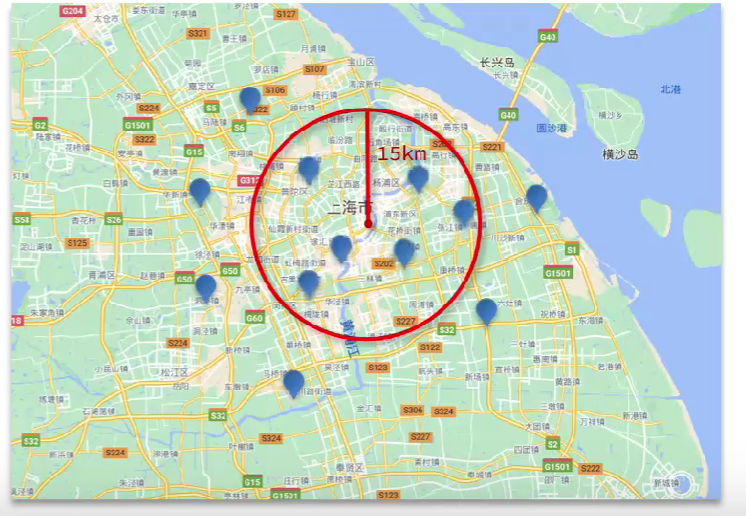

## 地理查询
查询我附近的酒店、滴滴打车、附近的人；都可以用es查询实现

### geo_bounding_box
geo_point落在某个矩形范围内的文档
```DSL
GET /hotel/_search
{
  "query": {
    "geo_bounding_box": {
      "location"  : {
        "top_left": {
        "lat" : "31.5",
        "lon" : "121.5"
      },
      "bottom_right" : {
        "lat" : "30.9",
        "lon" : "121.7"
      }
    }
    }
  }
}
```

### geo_distance
查询到指定中心点小于某个距离的所有文档(画圆范围内)


```DSL
GET /hotel/_search
{
  "query": {
    "geo_distance" : {
      "distance" : "15km",
      "location" : "31.21, 121.5"
    }
  }
}
```