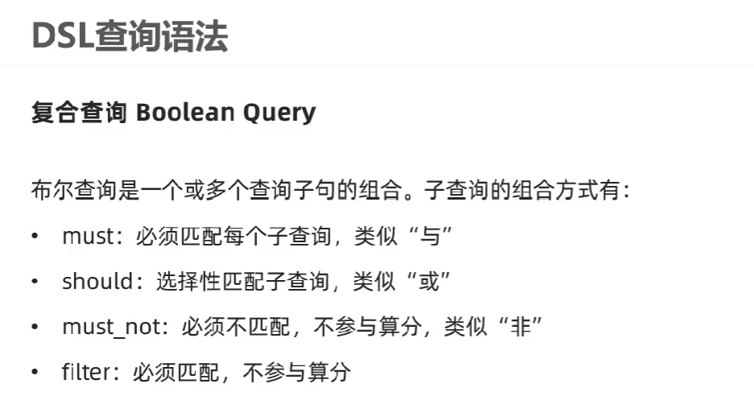

## BooleanQuery
布尔查询  
布尔查询可以将多个查询条件组合起来，实现更复杂的查询需求  


需求：查询酒店名字包含“如家”，价格不高于400，坐标在31.23,121.47附近的酒店
```DSL
# 布尔查询-将多个查询组合起来
GET /hotel/_search
{
  "query": {
    "bool": {
      "must": [
        {
          "match": {
            "name": "如家"
          }
        }
      ],
      "must_not": [
        {
          "range": {
            "price": {
              "gt": 400
            }
          }
        }
      ],
      "filter": [
        {
          "geo_distance": {
            "distance": "10km",
            "location": {
              "lat": 31.21,
              "lon": 121.5
            }
          }
        }
      ]
    }
  }
}

```