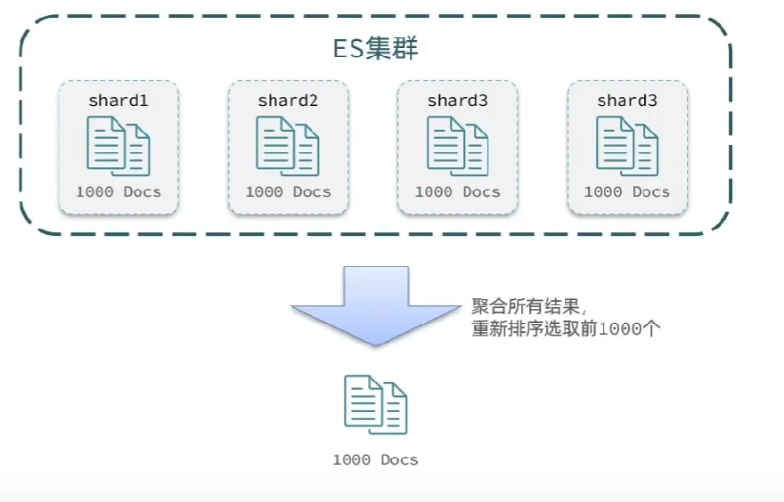

## 搜索结果分页
es默认分页大小为10，分页参数为from和size，类似与mysql的limit
```DSL
# 分页
GET /hotel/_search
{
  "query": {
    "match_all": {}
  },
  "sort": [
    {
      "price": {
        "order": "asc"
      }
    }
  ],
  "from": 0,
  "size": 10
}
```

es对分页大小做限制，最大为10000  
分页时，如果是集群部署，很难查到(每台机器查前1000，集中所有结果再取前1000)，
所有集群数据中的前1000条数据

- 深度查询，在前一次查询的基础上，再次查询