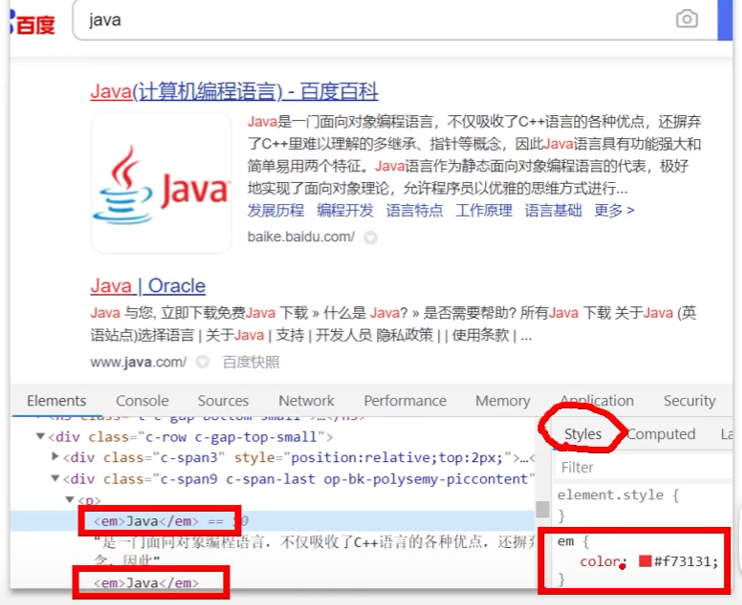
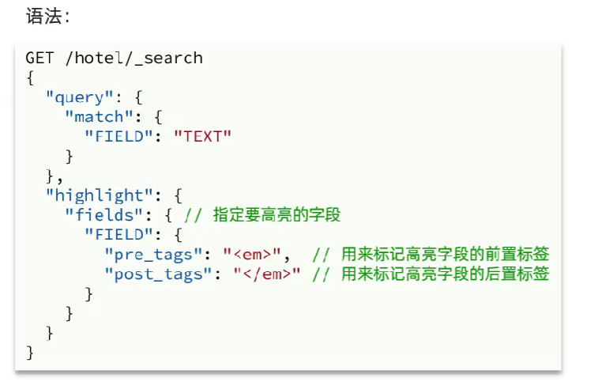

## 对es的搜索结果进行高亮
对结果中包含到关键字进行高亮显示



```DSL
GET /hotel/_search
{
  "query": {
    "match": {
      "all": "如家"
    }
  },
  "highlight": {
    "fields": {
      "all": {
        "require_field_match": "false"
      }
    }
  }
}
```